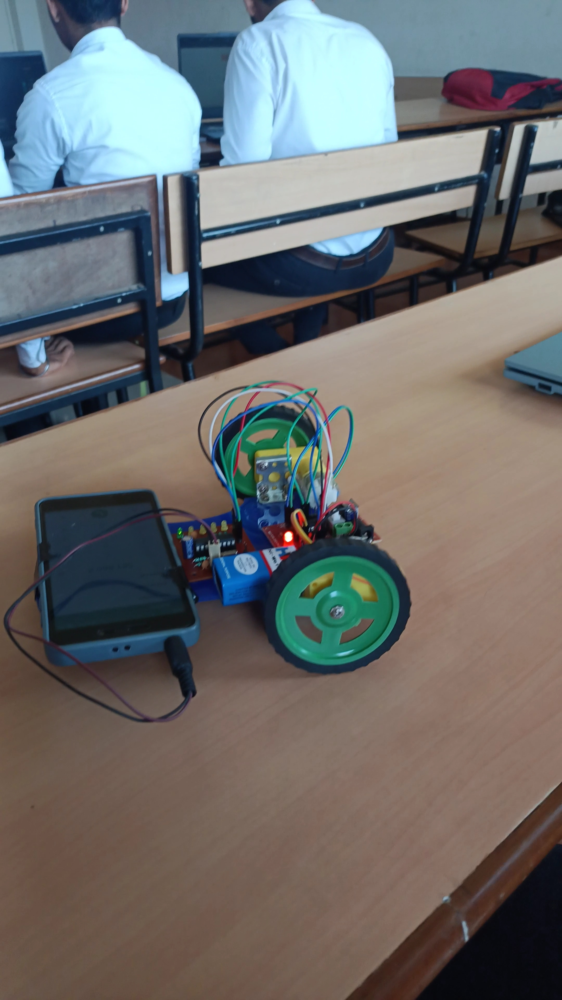

  <h1 align="center">🚗 Dual-Tone Multi-Frequency (DTMF) Controlled Robot Car</h1>  
    
    

 
A **DTMF-controlled robotic vehicle** that allows remote operation using mobile phone signals. This project leverages **Atmega328 microcontroller**, **DTMF decoder**, and **motor driver circuits** to interpret mobile keypad inputs and control the movement of the robot.

---

## 📌 Features

✅ **Mobile-Based Control** – Commands sent via mobile keypad using DTMF signals.  
✅ **Long-Range Communication** – Operates anywhere within the service provider's network.  
✅ **Microcontroller-Based Processing** – Uses Atmega328 to interpret signals and execute commands.  
✅ **Motor Driver Integration** – Controls DC motors for precise movements.  
✅ **Power Efficient** – Regulated DC power supply for stability.  

---

## 🛠️ Components Used

| Component            | Description |
|----------------------|------------|
| 📱 **DTMF Decoder**  | Converts received DTMF signals into binary commands. |
| 🎛️ **Motor Driver Circuit** | Controls the movement of the DC motors. |
| 🔋 **Power Supply**  | Converts AC power to DC for system operation. |
| ⚙️ **DC Motors**    | 6V 50 RPM motors used to drive the robot. |
| 🎛️ **Atmega328 Microcontroller** | Processes decoded commands and executes motor control. |

---

## 🏗️ System Architecture

1️⃣ **Mobile Phone (Transmitter)** – Sends DTMF signals when a key is pressed.  
2️⃣ **Mobile Phone (Receiver)** – Attached to the robot and set to auto-answer mode.  
3️⃣ **DTMF Decoder** – Converts received DTMF tones into binary signals.  
4️⃣ **Atmega328 Microcontroller** – Processes signals and generates movement commands.  
5️⃣ **Motor Driver Circuit** – Controls DC motor movement based on received commands.  

---

## 🔄 Working Mechanism

1. **Initiate a call** from the transmitter mobile to the receiver mobile attached to the robot.
2. **Press numeric keys** on the transmitter mobile to send DTMF tones.
3. The **DTMF decoder** processes the received tones and sends binary data to the **microcontroller**.
4. The **Atmega328 microcontroller** interprets the binary signals and sends commands to the **motor driver**.
5. The **motor driver circuit** controls the **DC motors**, moving the robot accordingly.

📌 **Example Controls:**
- **Key 2** → Move Forward  
- **Key 4** → Move Left  
- **Key 6** → Move Right  
- **Key 8** → Move Backward  
- **Key 5** → Stop  

---

## 📷 Circuit Diagram

> 

---

## 🛠️ Installation & Setup

1️⃣ **Assemble Hardware Components**:  
   - Connect **DTMF Decoder** to **Microcontroller**.  
   - Interface **Motor Driver Circuit** with **DC Motors**.  
   - Attach **Mobile Phone** in auto-answer mode.  

2️⃣ **Upload Code to Atmega328**:  
   - Write and upload the microcontroller program using **Arduino IDE**.  

3️⃣ **Run the System**:  
   - Make a call to the receiver mobile phone attached to the robot.  
   - Press numeric keys to control movement.  

---

## 🚀 Applications

🔹 **Military Surveillance** – Can be used for reconnaissance in hazardous areas.  
🔹 **Search & Rescue Operations** – Remote-controlled robots assist in rescue missions.  
🔹 **Industrial Automation** – Used in factories for automated transport.  

---

## 📜 Conclusion

This project effectively eliminates the limitations of RF-based robotic vehicles by using **DTMF technology**, allowing **long-range control** without interference. With its **microcontroller-based processing** and **robust motor control**, it serves as a foundation for **remote-controlled robotic applications** in various fields.  

---

## 🤝 Contributing

Contributions are welcome! Feel free to fork this repository, improve the code, and submit a pull request. 🚀  

---

## 📧 Contact

For any queries or suggestions, reach out at:  
📩 **Email:** p8775333@gmail.com  
🔗 **GitHub:** [PKulal](https://github.com/PKulal)

---

## Authors

- [@PKulal](https://github.com/PKulal)
- [@Praneeth-Jain](https://github.com/Praneeth-Jain/)
- S Harshavardhan
- Thoufeeq M I

---

🔹 **Star this repository ⭐ if you found it useful!**  
🔹 **Happy Coding! 🚀**
